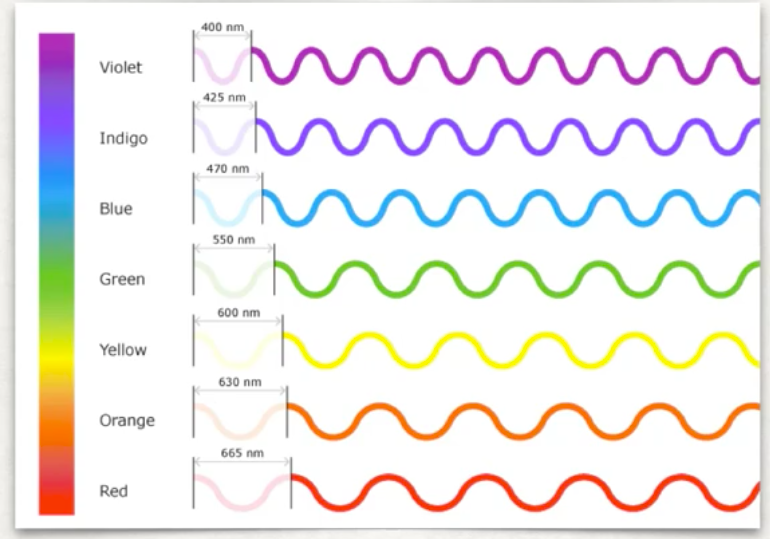
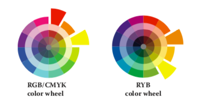

<a rel="license" href="http://creativecommons.org/licenses/by-nc-sa/4.0/"></a><br />R'da Renk Teorisi-RLADIES Eskişehir Sunumu 6 Mayıs 2021<a rel="license" href="http://creativecommons.org/licenses/by-nc-sa/4.0/"> Creative Commons Atıf-GayriTicari-AynıLisanslaPaylaş 4.0 Uluslararası Lisansı</a> ile lisanslanmıştır.

Hata ve öneriler için `r emo::ji("email")` ozge.ozdamar@msgsu.edu.tr


---
# Nasıl görürüz?

Nesnelerin üzerinden yansıyan ışık gözlere düz bir hat halinde ulaşır.

--

Işık kornedan, pupiladan ve göz merceğinden geçer.

--

Kornea ve göz merceği, ışığı kırarak retina üzerinde odaklanmasını sağlar.

--

Retina üzerindeki fotoreseptörler ışığı elektrik akımına dönüştürür.

--

Elektrik akımı, optik sinirden geçerek beyne ulaşır.

--

Beyin bu sinyalleri işleyerek görüntü oluşturur.

---


---
background-image: url(decode.png) 
background-size: 60%

---
class: center

.middle.center[


]


---
class: center, middle

# Renk


---


---



---

# Fiziksel


---
# Işıma


---
# Görsel ve Kavramsal

---
# Renk kanalları


---
# Link

TETRACHROMAT:
https://www.youtube.com/watch?v=5U31gXf4hwk


HOW ANIMALS SEE:
https://www.nhm.ac.uk/discover/how-do-other-animals-see-the-world.html

COLOR TEST:
https://color.method.ac


---
# Renk Körlüğü


---
class: center, middle


---
class: center, middle


---
class: center, middle


---
class: center, middle


---
class: center, middle

---
  


---

 

---

 

---

 

---

 
 
---

# Gestalt

<span style="color: blue;"> **Law of Proximity**</span> *(Yakınlık ilkesi)*

--

<span style="color: blue;"> **Law of Similarity**</span> *(Benzerlik ilkesi)*

--

<span style="color: blue;"> **Law of Segregation**</span> *(Ayrışma ilkesi)*


--

<span style="color: blue;"> **Law of Connectivity**</span> *(Bağlantı ilkesi)*

--

<span style="color: blue;"> **Law of Common Fate**</span> *(Ortak Kader ilkesi)*

--

<span style="color: blue;"> **Law of Closure**</span> *(Tamamlanma ilkesi)*

--

<span style="color: blue;"> **Law of Figure/Ground**</span> *(Şekil/Zemin ilkesi)*

--

<span style="color: blue;"> **Law of Continuity**</span> *(Devamlılık ilkesi)*


---
# Yakınlık ilkesi

Bilişsel sistemimiz, birbirine mekansal ya da zamansal olarak yakın olan elemanları anlamlı bir bütün oluşturması için gruplar. Yakınlık ilkesi (ing: law of proximity)  olarak isimlendirilen bu durum; insanların, birbirine yakın olan nesnelerin uzak olan nesnelere göre daha fazla benzer özelliklere sahip olduklarını (daha fazla ilişkili olduklarını) varsayamasından kaynaklanır. 


---


Bu ilkenin grafik üzerinde uygulaması çoğunlukla gruplandırılmış çubuk grafik, ya da saçılım diyagramı üzerinde uygulanır

Görselleştirmede aktarılmak istenilen bilginin önem sırasına göre, odaklanılnası istenilen bilgi gruplandırılarak dikkat çıkarılır.

---


---


---
# Benzerlik ilkesi

Bilişsel sistemimiz benzer elemanları anlamlı bir bütün oluşturması için gruplar. Gruplama işlemi renk, büyüklük ya da şekle göre olabilir.


---


--


---
# Şekil/Zemin Etkisi

Bilişsel sistemimiz, kontrast, renk, boyut gibi görsel bir değişkene dayanarak nesneleri arka fondan ayırarak algılar


---

# Renk Modelleri

Renk modelleri, ana renkler kullanılarak daha geniş bir renk skalası oluşturmak için geliştirilmiş matematiksel modellerdir.

<span style="color: blue;"> **RGB**</span> *(Red, Green Blue)*

--

<span style="color: blue;"> **CMYK**</span> *(Cyan, Magenda, Yellow, Key)* 

--

<span style="color: blue;"> **HSB**</span> *(Hue, Saturation, Brightness)*

--

<span style="color: blue;"> **HSV**</span> *(Hue, Saturation, Value)*

--

<span style="color: blue;"> **HCL**</span> *(Hue, Chroma, Luminance)*


--

<span style="color: blue;"> **HSI**</span> *(Hue, Saturation, Intensity)*


---


---
# Renk şemaları

Color schemes, color harmony

<span style="color: blue;"> **Monochromatic**</span> *(tr: Monokromatik Şema)*


--

<span style="color: blue;"> **Analogous**</span> *(tr: Analog-Benzer Şema)*


--

<span style="color: blue;"> **Complementary**</span> *(tr:Tamamlayıcı Şema )*

--

<span style="color: blue;"> **Split Complementary**</span> *(tr: Bölünmüş Tamamlayıcı Şema )*


--

<span style="color: blue;"> **Analogous Complementary **</span> *(tr: Analog Tamamlayıcı Şema )*


--

<span style="color: blue;"> **Double Complementary **</span> *(tr: Çift Tamamlayıcı Şema )*


--

<span style="color: blue;"> **Tetrad: Rectangular & Square**</span> *(tr:Dört Renk Şeması )*


--

<span style="color: blue;"> **Diad**</span> *(tr: İkili Şema )*


--

<span style="color: blue;"> **Triad**</span> *(tr: Üçgen Şema )*


---
class: center, middle

 


---

class: center, middle


---
# Monokromatik Şema


- Monokromatik şema, renk çarkında tek bir renk(anahtar renk) üzerinde farklı tonlama ve gölgeleme, tint, tone ve shade uygulayarak elde edilen renk şemasıdır. 

--

- Anahtar rengin seçimine (sıcak ya da soğuk olması) bağlı olarak sıcak ya da soğuk duygu yaratır, renkler dengeli ve oluşturulan görsel şık ve çekicidir. 
--

- Özellikle mavi veya yeşil anahtar renkler monokromatik şemada gözü yormayan, yatıştırıcı bir etki yaratır. 

--

- Bu şema, kontrast oluşturmak için uygun değildir ancak yeterli kontrast oranının sağlanması durumunda renk körleri tarafından algılanabilir. 


--

- Görsel üzerindeki önemli bilgiye dikkat çekmek için monokromatik şema uygun değildir. Tamamlayıcı şema gibi canlı bir etki bırakmaz. Eğer monokromatik şemanın basitlik ve şıklık etkileri kullanılmak istenirse, daha fazla nüans öneren analog şema tercih edilebilir.

---

# Analog Şema


- Analog(benzer) şema, renk çarkında yan yana duran üç renkten oluşan renk düzenidir. Bu üç renk, seçilen anahtar renk ve onun birer yan tarafındaki renklerden oluşur. Analog şemayla çoğunlukla doğada karşılaşırız, örnek olarak sonbaharda ağaçların değişimindeki renk örüntüsü verilebilir.

--
 
- Önerdiği renk skalası dar olmakla birlikte, göze uyumlu görünen bir renk düzendir. Monokromatik şemada olduğu gibi seçilen anahtar renge göre soğuk ya da sıcak duygu oluşturur, ancak şema içinde hem sıcak ve hem de soğuk renklerin birlikte kullanılması tercih edilmemelidir. 

--

- Renk armonisini olumsuz yönde etkileyeceği için, bu şeması içinde çok fazla renk kullanılmamalıdır.


---
class: center, middle


---

# Tamamlayıcı Şema


Tamamlayıcı renk şeması (ing: complementary scheme), renk çarkı üzerinde birbirine karşıt şekilde konumlanmış renklerden oluşur. Seçilen anahtar renk, tam karşısındaki renk ile beraber kullanıldığından, kontrast oranı en yüksek şemadır. Bu yüzden dikkat çekme özelliği çok yüksektir.

--

Tamamlayıcı şema yüksek kontrast oluşturduğundan, monokromatik ve analog şemalara göre renklerin dengelenmesi özellikle desaturated(gri eklenmiş) sıcak bir rengin anahtar renk olarak seçilmesi durumunda zordur.

---

class: center, middle


---
# Bölünmüş Tamamlayıcı


Bölünmüş tamamlayıcı şema (ing: split complementary scheme), seçilen anahtar renk ile birlikte anahtar rengin tamamlayıcısının iki yan tarafındaki renklerden oluşan şemadır, böylelikle yüksek kontrast sağlanmış olunur.

--

Monokromatik ve analog şemalara göre renk dengesi daha zor sağlanır.

--

Tamamlayıcı şemaya göre artısı, yüksek kontrastı korurken, daha fazla nüans önermesidir. 


---
class: center, middle


---
# Analog Tamamlayıcı


Analog tamamlayıcı şema (ing: analogous complementary scheme), bölünmüş tamamlayıcı semaya ek olarak, anahtar rengin tamamlayıcısının da dahil edilmesiyle elde edilir.


---
# Çift Tamamlayıcı


Çift tamamlayıcı şema (ing: double complementary scheme), renk çarkı üzerinde yanyana duran iki rengin tamamlayıcı renkleriyle birlikte 2 ayrı tamamlayıcı renk çiftinden oluşan şemadır.

---

# Dört Renk Şeması


Dört renk şeması (ing: tedrad scheme) renk çarkında birbirinden eşit uzaklıkta yerleşmiş dört rengin kullanılmasıyla oluşturulan düzendir. İki anahtar renk ve o renklerin tamamlayısından oluşur. Dört renk şeması, anahtar renkler arası uzaklığa göre renklerin çark üstündeki yerleşimi değişiklik göstereceğinden, oluşan yerleşime göre farklı isimlendirilir. Dört rengin yerleşimi bir dikdörtgen ya da kare oluşturabilir.

--

Renkler arası uzaklık, renk yerleşimini bir kare ya da dikdörtgen oluşturacak şekilde belirlenebilir, böylelikle iki ayrı tamamlayıcı renk çifti kullanılmış olur. Çift tamamlayıcı şema da bu gruba dahil edilebilir.

--

Diğer şemalara göre renklerin dengelenmesinin en zor olduğu şemadır. 


---
class: center, middle


---
# Dikdörtgen Şema

Dikdörtgen şema (ing: rectangular scheme), birbiri arasında bir boş olacak şekilde seçilen iki anahtar renk ve tanamlayıcısından oluşur. Dört renk böylelikle çark üzerinde bir dikdörtgen oluşturacak şekilde yerleşmiş olur.

--


Sıcak ve soğuk renklerin dengelenmesine dikkat edilmelidir.

--

Çift tamamlayıcı şema da anahtar renkleri yanyana olan dikdörtgen şemadır.

---
# Kare Şema


--

Anahtar renkler, aralarında 2 boşluk olacak şekilde seçilirse, dört renk çark üzerinde kare olarak yerleşeceği için, kare şema (ing: square scheme) adını alır.


---
# İkili Şema



--

İkili şemada anahtar rengin 2 yanındaki tek renk seçilir.


---
# Üçgen Şema


--

Üçgen şema (ing: triad scheme), renk çarkında eşkenar üçgen oluşturacak şekilde birbirine eşit uzaklıkta bulunan üç renkten oluşan şemadır. Şema; seçilen anahtar renk ve ek olarak bu rengin iki yönde eşit uzaklıktaki renklerle birlikte oluşturulur.

--

Üçgen şema, renk dengesini korurken güçlü kontrast oluşturması nedeniyle sık tercih edilen bir şemadır. 

--

Üçgen şema, tamamlayıcı şema kadar kontrast sağlamaz ancak ona gore daha dengeli ve uyumludur.


---
class: center, middle


---
# Renk paletleri

**sürekli değişkenlerin renkle kodlanması:**

Sürekli değişkenler için renk paleti belirlerken dikkat etmemiz gereken iki durum vardır.

Renk paletinde tekdüzelik (ing: uniformity) : Renk paletindeki renk değişimlerinin tekdüze olarak algılanması. Örneğin sürekli bir değişkeni tek renkle kodlamak için monokromatik bir şema seçtiysek, anahtar rengin tint/tone/shade in aynı oranlarda değişerek paleti oluşturmak gerekir. Bunun nedeni, paletteki renk değişiminin, algısal olarak da eşdeğer oranda algılanmasının gerekliliğidir.


--

Renk paletinde ayrımcılık (ing: discriminability): Sürekli değişkenin gözlem değerlerini renkle kodlarken renklerin sağladığı ayrımcılık mümkün olduğunca fazla olmalıdır.
Seçilen şemaya bağlı olarak sürekli değişken için oluşturduğumuz palette tek renkten (sequential scale) ya da çok renkten ( sequential ve diverging) oluşabilir

---

**kategorik değişkenkenlerin renkle kodlanması:**

kategorik değişkenler için de renk paletinde tekdüzelik sağlamak gerekir, ancak bu sürekli değişkenlerden farklılık gösterir. Örneğin monokromatik şemadaki gibi tekdüzelik, kategorik değişkenler için uygun olmayacaktır, çünkü bu şemadaki ışık ya da doygunluk, dikkati kendine çekerek bazı grupları öne çıkarabilir. Birden fazla renkten oluşan palet daha uygun olacaktır.

---
**Aynı anda kaç tane ayrı renk algılanabilir?**

Bu konuda yapılan algısal çalışmalar bir grafikte 5-10 arası rengin insalar tarafından algılanabildiğini önermektedir.

--

Kırmızı, mavi, yeşil, sarı, siyah ve beyaz algısal olarak çok yüksek seviyede ayrıştırılıyor, kültürlerden bağımsız kabul ediliyor.

--

Gri renk olarak algılanmıyor. Bu özelliği renkle kodlamada kullanılabilir. Örnek: dikat çekilmek istenilen bilgi kırmızı, diğerleri gri

---

12 renk, bütün kültürlerde farklı olarak isimlendirilmiştir. Bu da, 12 renngin insanlar tarafından net olarak algılanabilir olduğunun işareti olarak kabul edilmekte.

--


---
# Grafiklerde Renk

Görsel algılama skalasında renk en alt seviyede olmasından dolayı kullanırken özellikle dikkat edilmeli! Renk paleti seçiminde Gestalt prensipleri ve renk şemaları gözönünde bulundurulmalı.

--

Renk modelinden bağımsız olarak, bir rengi üç parametre ile tanımlayabiliriz:

--

**Hue:** Renk ismi

**Saturation:** rengin canlılığı (doygunluk)

**Luminance:** rengin ışığı/ parlaklığı  yansıtma miktarı

--

Veri görselleştirilmesinde renkle kodlamayı amacımızı iki kategoride toplayabiliriz:

--

Miktarı kodlamak

--

Etiketlemek ( + odaklanmayı sağlamak/dikkat çekmek)

---
class: inverse, center, middle
R uygulamaları

---

**R'da ki renkler**
```{r, eval=FALSE}
colors()
colours()
```

**Colors in R:** http://www.stat.columbia.edu/~tzheng/files/Rcolor.pdf

**R Color cheatsheet:**
https://www.nceas.ucsb.edu/sites/default/files/2020-04/colorPaletteCheatsheet.pdf
---
```{r, message=FALSE}
library(vcd)
data("Hospital")
barplot(Hospital, beside = T)
```

---
class: inverse, middle, center

Renkleri 4 şekilde elde edebiliriz:

---
# 1. Renk isimleri ile

```{r}
barplot(Hospital, beside = T, col=c("red","blue","green"))
```

---

# 2. Hexadecimal kodu ile

kırmızı : #FF0000
mavi: #0000FF
yeşil: #00FF00

```{r}
barplot(Hospital, beside = T, col=c("#FF0000","#0000FF","#00FF00"))
```
---

# 3. Renk modeli ile

**kırmızı**
```{r}
rgb(red = 255, green = 0, blue = 0, maxColorValue = 255)
```
**mavi**
```{r}
rgb(0,0,255, maxColorValue = 255)
```

**yeşil**
```{r}
rgb(0,255,0, maxColorValue = 255)
```

---
**rengin RGB model değerleri**
```{r}
col2rgb("red")
```

---
**HSV: Hue, Saturation, Value**

```{r}
hsv(h = 1, s = 1, v = 1, alpha=0.3) # alpha 0-1 arası saydamlık 
```
**HCL:Hue, Chroma, Luminance**
```{r}
hcl(h = 0, c = 35, l = 85, alpha=0.5)
```

---
# 4. Palet sıra numarası kullanılarak
```{r}
palette() # aktif paleti verir
```

---
# Renk modeli değiştirme

```{r, eval=FALSE}
grDevices::col2rgb()
grDevices::rgb2hsv()
colorspace::hex2RGB()
colorspace::convertColor()
```

---
# R' da şemalar


```{r}
library(colortools) # anahtar renk: kırmızı için renk şemaları
adjacent("red") # analog şema
```

---
```{r}  
complementary("red") # tamamlayıcı şema
```


---
```{r}
splitComp("red") # bölünmüş tamamlayıcı şema
```


---
```{r}
triadic("red") # üçgen şema
```

---
```{r}
tetradic("red") # dörtlü şema
```

---
```{r}
square("red") # kare şema
```


---
# Palet paketleri

Birçok palet paketi mevcut, ancak şema bazlı tasarlanmış olmayabilirler!! Kullanacağımız paleti seçerken şema ve kategorik/sürekli değişken ayırımının farkında olmamız gerekiyor!!

```{r, eval=FALSE}
# grDevices paketine ait palet fonksiyonları
rainbow()
heat.colors()
topo.colors()
terrain.colors()
cm.colors()
gray.colors()
```

---
```{r}
pie(rep(1, 5), col = heat.colors(5))
```

---
```{r}
pie(rep(1, 5), col = terrain.colors(5))
```

---
```{r}
palette()
pie(rep(1, 3), col = c(2,3,5))
```
---
# RColorBrewe palet paketi
```{r}
library(RColorBrewer)
display.brewer.all()
```

---
```{r}
display.brewer.pal(n=3, name="Blues")
brewer.pal(n=3, name = "Blues")
```

---
```{r}
display.brewer.pal(n = 8, name = 'Dark2')
```
---
```{r}
barplot(Hospital, beside = T, col = brewer.pal(n=3, name='Blues'))
```

# renk körlüğü için palet paketleri:

```{r, eval=FALSE}  
library(colorBlindness)

library(dichromat)

remotes::install_github("clauswilke/colorblindr")
```

https://github.com/clauswilke/colorblindr


---
# Kolaylaştırıcı paketler
```{r} 
library(colourpicker) # Görsel olarak renk seçimi yapmak için
library(colorspace) # diverging, sequential,  qualitative palet seçimi & ayarlar
renk<-choose_palette()
n<-5
pie(rep(1, n), col = renk(5))
```

---
# Renk Araçları

https://hclwizard.org


https://paletton.com/#uid=1000u0kllllaFw0g0qFqFg0w0aF

https://colorbrewer2.org/#type=sequential&scheme=BuGn&n=3

---

Information Visualization Perception for Design, Colin Ware.


Color Space and Its Divisions, Rolf G. Kuehni.


Appliying Color Theory to Digital Media and Visualization, Theresa-Maria Rhyne.


The Complete Color Harmony, Leatrice Eiseman
---
